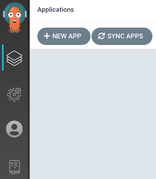
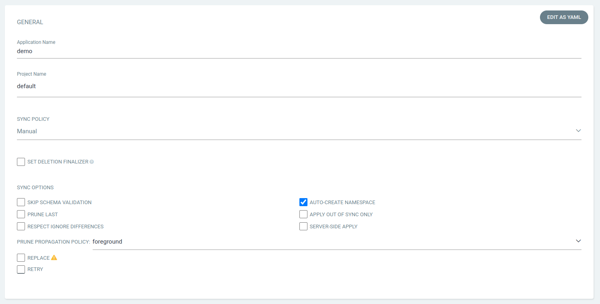
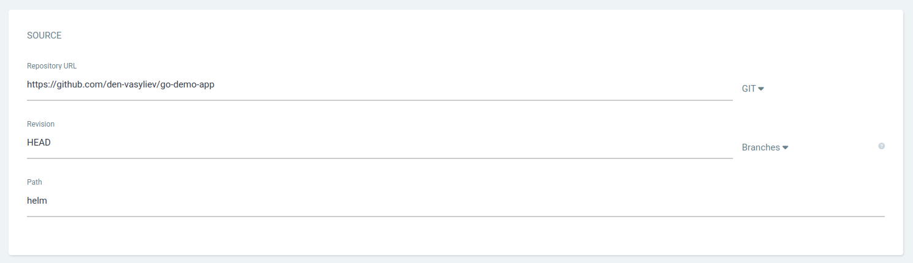
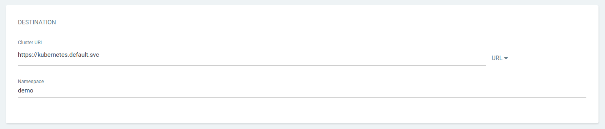
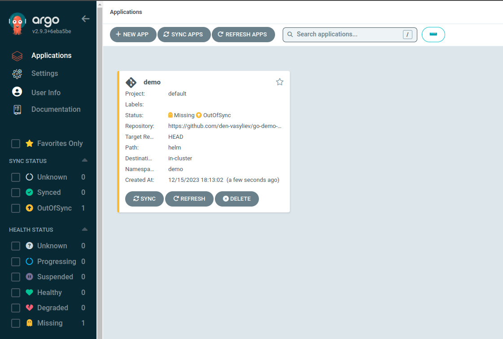
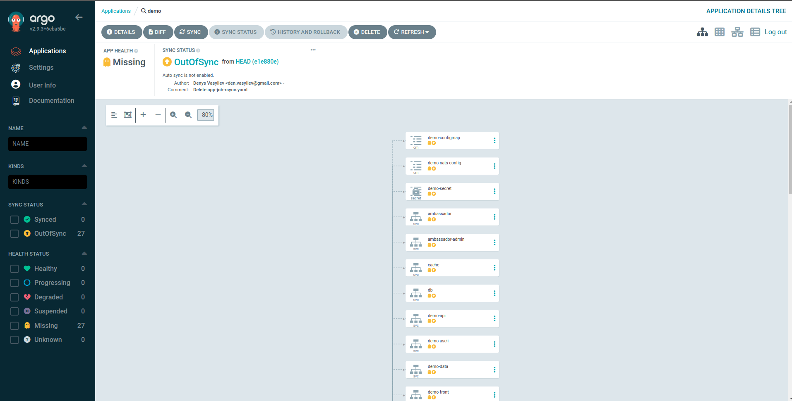
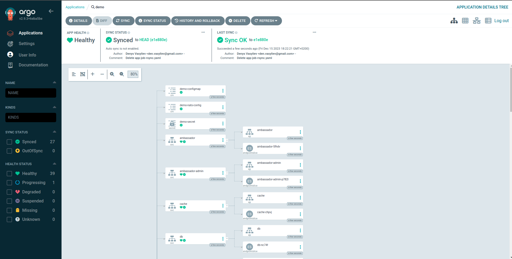

# Minimum Viable Product

Open a browser to the Argo CD external UI, and login by visiting the `https://localhost:8080` in a browser.

## Create The Application



After logging in, click the "+ NEW APP" button as shown above and fill in the details like:

- GENERAL:

  - Application Name: `demo`
  - Project Name: `default` (select from the drop-down list)
  - SYNC OPTIONS: Check the box opposite "AUTO-CREATE NAMESPACE"

  

- SOURCE:

  - Repository URL: `https://github.com/den-vasyliev/go-demo-app` and select from the drop-down list "GIT"
  - Revision: select from the drop-down lists "HEAD" and "Branches"
  - Path: select from the drop-down list "helm"

  

- DESTINATION:

  - Cluster URL: select from the drop-down list "https://kubernetes.default.svc" (local kubernetes)
  - Namespace: `demo`

  

After filling out the information above, click "CREATE" at the top of the UI to create the `demo` application:




## Sync (Deploy) The Application






## Create and Sync (Deploy) the Application with ArgoCD CLI

### Install ArgoCD CLI

```bash
curl -sSL -o argocd-linux-amd64 https://github.com/argoproj/argo-cd/releases/latest/download/argocd-linux-amd64
sudo install -m 555 argocd-linux-amd64 /usr/local/bin/argocd
rm argocd-linux-amd64
```

### Login

```bash
argocd admin initial-password -n argocd
```

Дана команда виведе наступне:

```text
vPhKYyUh3ItRHhvm

This password must be only used for first time login. We strongly recommend you update the password using `argocd account update-password`.
```

`vPhKYyUh3ItRHhvm` is our password (your password will be different).

```bash
argocd login 127.0.0.1:8080
```

You will need to accept the self-signed certificate by typing `y`, enter the username `admin` and the password `vPhKYyUh3ItRHhvm`.

### Create the application using the Kubernetes manifest

Create `app.yaml` file:

```yml
apiVersion: argoproj.io/v1alpha1
kind: Application
metadata:
  name: demo
  namespace: argocd
spec:
  project: default
  source:
    repoURL: https://github.com/den-vasyliev/go-demo-app.git
    targetRevision: HEAD
    path: helm
  destination:
    server: https://kubernetes.default.svc
    namespace: demo
  syncPolicy:
    syncOptions:
    - CreateNamespace=true
```

and run the following command:

```bash
kubectl apply -f app.yaml
```

as a result, you will receive a `application.argoproj.io/demo created` message, which will mean that your ArgoCD application has been created

### Sync (Deploy) The Application with ArgoCD CLI

```bash
argocd app sync demo
```

## Demo


